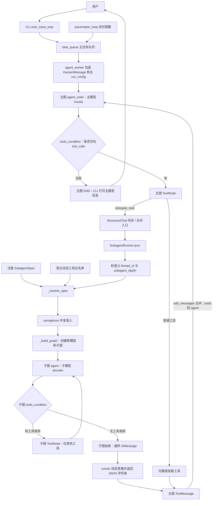
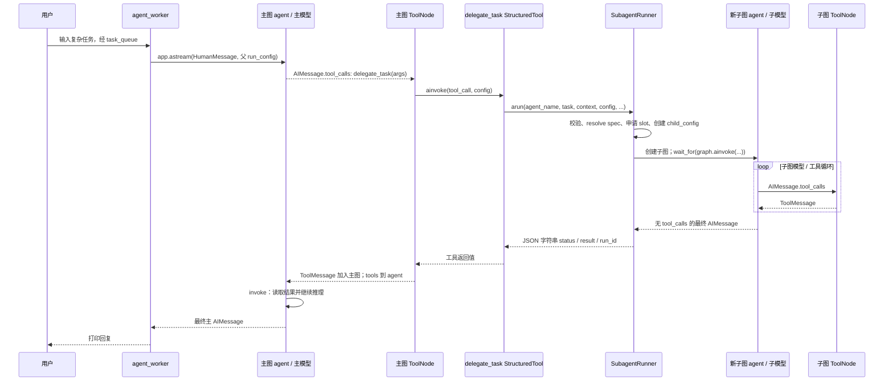

# CyberClaw 团队模式实现：从主图工具调用到独立子图返回

分析对象：`D:\cyberclaw` 当前源码，Git HEAD `12b7c6d52fcc38e134cd0f1aeb7aba420ad23274`。分析日期：2026-09-14。

本文以源码调用关系为依据。README 与 `docs/SUBAGENTS.md` 只用于交叉核对；测试中替代模型的行为与真实模型自主决策分开讨论。

## 1. 核心结论

这个项目采用 **LLM 工具调用驱动、单层主从、调用内等待结果的 Sub-Agent 架构**：

1. 主 Agent 是 `create_agent_app()` 构建的 LangGraph 主图，真正进行决策的是图内 `agent_node()` 调用的绑定工具模型。
2. 主模型可以生成名为 `delegate_task` 的 tool call。主图 `ToolNode` 执行它。
3. `delegate_task` 的闭包持有一个 `SubagentRunner`。runner 选择预注册角色或构造本次调用的临时角色，创建全新的模型实例和子图。
4. 子图拥有自己的 `agent → tools → agent` 循环、消息状态、运行标识和工具集合。默认只允许读取 office 文件。
5. runner 等待子图结束，只把最终答案包装成 JSON 字符串返回。主图获得对应 `ToolMessage`，继续调用主模型。
6. 主模型负责检查状态、整合结论、决定是否继续使用工具，最后回答用户。

这里的“团队管理”只有角色注册表、工具能力配置、并发准入与执行预算管理。没有独立 Team 对象、持久成员会话、共享任务看板、成员互发消息、自动任务依赖调度或控制权 handoff。

代码入口：[主图创建](D:/cyberclaw/CyberClaw/core/agent.py:21)、[runner](D:/cyberclaw/CyberClaw/core/subagents.py:113)、[委派工具封装](D:/cyberclaw/CyberClaw/core/subagents.py:304)。

## 2. 全局定位与职责

搜索覆盖仓库源码、入口、示例、测试和文档。关键词包括 `team`、`agent team`、`subagent`、`sub-agent`、`delegate`、`delegation`、`spawn`、`task`、`worker`、`coordinator`、`orchestrator`、`supervisor`、`child agent`、`parent agent`、`teammate`、`member`、`handoff`、`dispatch`、`assign`、`run_agent`、`create_agent` 和 `agent tool`。先全局定位，再按调用关系排除无关命中。

### 2.1 直接参与委派的组件

| 文件与源码入口 | 核心类型 / 函数 | 实际职责 |
| --- | --- | --- |
| [CyberClaw/core/agent.py](D:/cyberclaw/CyberClaw/core/agent.py:21) | `create_agent_app()`、内部 `agent_node()` | 构建主图，注册委派工具，向主模型提供工具 schema 和委派提示，接收工具结果并继续推理 |
| [CyberClaw/core/subagents.py](D:/cyberclaw/CyberClaw/core/subagents.py:32) | `SubagentSpec`，冻结 dataclass | 保存角色名称、描述、指令、工具以及可选 provider/model；这是角色配置，不是一个运行中的 Agent |
| [CyberClaw/core/subagents.py](D:/cyberclaw/CyberClaw/core/subagents.py:51) | `DelegationInput`，Pydantic model | 校验模型生成的委派参数，拒绝额外字段；不暴露可信运行配置 |
| [CyberClaw/core/subagents.py](D:/cyberclaw/CyberClaw/core/subagents.py:77) | `default_subagents()` | 创建 `code_reviewer` 与 `document_analyst` 两份默认角色配置；不立即实例化子模型 |
| [CyberClaw/core/subagents.py](D:/cyberclaw/CyberClaw/core/subagents.py:113) | `SubagentRunner.__init__()` | 持有注册角色、动态工具白名单、默认模型与预算，以及所有调用共享的 semaphore |
| [CyberClaw/core/subagents.py](D:/cyberclaw/CyberClaw/core/subagents.py:140) | `_resolve_spec()` | 选择预设角色或创建调用局部的临时角色，并校验可用工具 |
| [CyberClaw/core/subagents.py](D:/cyberclaw/CyberClaw/core/subagents.py:160) | `_build_graph()`、内部异步 `agent_node()` | 创建子模型并绑定角色工具，构建独立模型 / 工具循环；不使用主图工厂 |
| [CyberClaw/core/subagents.py](D:/cyberclaw/CyberClaw/core/subagents.py:203) | `arun()`、内部 `execute()` / `result()` / `emit()` | 校验作用域、并发准入、创建独立配置、执行子图、处理超时与错误、包装答案、记录审计 |
| [CyberClaw/core/subagents.py](D:/cyberclaw/CyberClaw/core/subagents.py:296) | `run()` | 同步桥接：没有运行中的事件循环时，以 `asyncio.run(arun(...))` 执行 |
| [CyberClaw/core/subagents.py](D:/cyberclaw/CyberClaw/core/subagents.py:304) | `as_tool()`、内部 `delegate_task()` / `adelegate_task()` | 把同一个 runner 封装成具有同步和异步入口的 `StructuredTool` |
| [CyberClaw/core/context.py](D:/cyberclaw/CyberClaw/core/context.py:5) | `AgentState`、`add_messages` reducer | 主、子图共用状态类型定义；每个图调用持有不同状态。消息按 reducer 合并 |
| [CyberClaw/core/provider.py](D:/cyberclaw/CyberClaw/core/provider.py:18) | `get_provider()` | 创建模型适配器；主模型创建一次，子模型每次被准入的委派重新创建 |
| [entry/main.py](D:/cyberclaw/entry/main.py:91) | `async_main()`、内部 `agent_worker()` / `user_input_loop()` | CLI 用户输入排队，运行主图并打印最终主模型回复 |

框架组件是 `StateGraph`、`ToolNode`、`tools_condition`、`StructuredTool`、`RunnableConfig`、`AIMessage` 与 `ToolMessage`。项目把工具分发和工具结果消息化交给框架；没有另写一个子 Agent RPC 协议。

### 2.2 支持组件与容易误判的命中

| 文件 / 命中 | 根据调用关系的判断 |
| --- | --- |
| [CyberClaw/core/tools/sandbox_tools.py](D:/cyberclaw/CyberClaw/core/tools/sandbox_tools.py:206) | `list_office_files`、`read_office_file` 是默认子角色的实际能力；`_get_safe_path()` 限制 office 相对路径 |
| [CyberClaw/core/skill_loader.py](D:/cyberclaw/CyberClaw/core/skill_loader.py:135) | `LazySkillLoader` 把外部技能封装为工具。仅在宿主显式给子角色授权时参与子图执行，不是子 Agent 创建器 |
| [CyberClaw/core/logger.py](D:/cyberclaw/CyberClaw/core/logger.py:9) | `JSONLEventLogger` 记录生命周期与模型 / 工具事件；`worker_thread` 负责写日志，不是子 Agent |
| [entry/monitor.py](D:/cyberclaw/entry/monitor.py:74) | `render_event()` 展示父子运行标识和生命周期；不驱动调度 |
| [CyberClaw/core/bus.py](D:/cyberclaw/CyberClaw/core/bus.py:4) | `task_queue` / `emit_task()` 是 CLI 主任务输入队列。`SubagentRunner.arun()` 没有调用它，不是子 Agent mailbox |
| [CyberClaw/core/heartbeat.py](D:/cyberclaw/CyberClaw/core/heartbeat.py:11) | `pacemaker_loop()` 把到期提醒投递到同一个主任务队列。它不会选择子角色或创建子图 |
| [CyberClaw/core/tools/builtins.py](D:/cyberclaw/CyberClaw/core/tools/builtins.py:134) 与 [task_storage.py](D:/cyberclaw/CyberClaw/core/task_storage.py:7) | `schedule_task()` 与任务 JSON 原子存储用于定时任务，不承担本次委派的任务分解、追踪或结果合并 |
| [entry/cli.py](D:/cyberclaw/entry/cli.py:168) 的 `run_agent()` | 启动 CLI 主程序，不是运行子 Agent 的接口 |
| `tests/test_redteam_*.py` | red team 安全测试；名称中的 team 不表示多个 Agent 协作 |
| `tests/test_two_phase_skills.py` 中 orchestrator / dispatcher / worker | 测试技能名称和描述，用于技能选择评估，未接入子图委派链 |
| [tests/test_subagents.py](D:/cyberclaw/tests/test_subagents.py:1) | 包含真实 LangGraph 与 ToolNode 往返测试；只替换模型和部分 I/O，不是只测试函数命名 |
| `docs/SUBAGENTS.md` | 使用文档，可用于核对，但不是架构结论的原始依据 |

## 3. 实际架构



作用域、角色或配额检查不通过时，runner 直接返回 rejected / busy，不创建子模型。

| 架构问题 | 对应实现 |
| --- | --- |
| 谁是真正的 Main Agent？ | 主图的 `agent_node()` 与它捕获的 `llm_with_tools`。`agent_worker()` 只是运行入口 |
| 谁管理团队？ | `SubagentRunner` 管理角色配置、允许工具与执行配额，没有完整团队生命周期对象 |
| 谁创建子 Agent？ | `_resolve_spec()` 创建或选择配置；`_build_graph()` 真正创建子模型和子图 |
| 谁执行子 Agent？ | `arun()` 内 `execute()` 调用 `graph.ainvoke()`，由 LangGraph 执行节点循环 |
| 谁收集结果？ | runner 提取一个子图最终答案，框架把工具返回值写入主图消息 |
| 谁语义汇总结果？ | 下一轮主模型。源码没有单独 `ResultMerge` 节点或确定性合并函数 |

主图和子图都包含模型循环，因此子 Agent 并非只调用一次 LLM 的普通辅助函数。但子图是工具调用内临时创建的执行单元，不是驻留进程中的长期队友。

## 4. 团队能力如何进入主模型工具列表

`create_agent_app()` 的装配链是：

```text
tools is None ? BUILTIN_TOOLS + load_dynamic_skills() : list(tools)
    ↓
根据 enable_subagents / subagent_specs 判定是否自动注册
    ↓
SubagentRunner(...主 provider/model、角色与动态能力配置...)
    ↓
actual_tools.append(runner.as_tool())
    ↓
工具名唯一性校验
    ↓
ToolNode(actual_tools) + get_provider(...).bind_tools(actual_tools)
    ↓
主图 agent / tools 节点和条件边
    ↓
workflow.compile(checkpointer=checkpointer)
```

对应 [agent.py:38](D:/cyberclaw/CyberClaw/core/agent.py:38)。同一份 `actual_tools` 同时用于模型可见的工具绑定和执行端分发。

| 创建方式 | 自动追加 delegate_task？ |
| --- | --- |
| `create_agent_app()` | 是 |
| `create_agent_app(tools=[...])`，没有 specs、没有显式 enable | 否，保持显式工具集合 |
| `create_agent_app(tools=[...], enable_subagents=True)` | 是 |
| 提供 `subagent_specs`，enable 未指定 | 是 |
| `enable_subagents=False` | 不自动追加，即使提供 specs |

**`enable_subagents=False` 控制的是自动装配，不是全局禁止执行委派。** 宿主仍可把自建 `runner.as_tool()` 显式放入 `tools`。此时自动追加的主系统委派提示不会出现，但工具自身的 description 和 schema 仍然存在。重复追加同名工具会在名称校验处失败。

子模型是惰性创建：`SubagentRunner.__init__()` 仅构建配置和 semaphore，只有获得 slot 后进入 `_build_graph()` 才调用子模型 provider 工厂。

## 5. 完整委派调用链

### 5.1 用一个具体场景理解输入

用户要求：“分析 office 内 `project/agent.py` 的实现机制，并结合 `project/design.md` 给出测试缺口。”

这是按真实 API 构造的说明场景，并非声称曾调用真实模型完成这条用户任务。模型可能选择两个预设角色，也可能选择一次委派或直接回答；代码不强制拆分。

一个有效的预设角色调用参数是：

```json
{
  "agent_name": "code_reviewer",
  "task": "阅读 project/agent.py，解释调用链并指出关键测试缺口，返回证据和来源路径。",
  "context": "仅分析代码，不修改文件；重点检查工具执行后的结果如何回到模型。"
}
```

这些字段由主模型写入 `AIMessage.tool_calls[i].args`。它们不是系统自动从用户消息抽取的 `Task` 对象。

### 5.2 分阶段追踪

| 阶段 | 文件 / 核心函数 | 输入 | 输出 | 下一步 |
| --- | --- | --- | --- | --- |
| 1. 用户任务进入 | [entry/main.py:203](D:/cyberclaw/entry/main.py:203)，`user_input_loop()` | `session.prompt_async()` 返回的字符串 | 非空、非退出命令放入 `task_queue` | `agent_worker()` 消费 |
| 2. 运行主 Agent | [entry/main.py:150](D:/cyberclaw/entry/main.py:150)，`agent_worker()` | 队列字符串、基础会话 config | `inputs.messages=[HumanMessage(...)]`；父 thread_id 与新的 run_id | `app.astream(..., stream_mode="updates")` |
| 3. 主模型决定 | [agent.py:63](D:/cyberclaw/CyberClaw/core/agent.py:63)，主 `agent_node()` | 主图历史、摘要、画像、系统提示和工具 schema | `llm_with_tools.invoke()` 返回 `AIMessage` | 追加 state 后执行 `tools_condition` |
| 4. 路由到工具 | [agent.py:214](D:/cyberclaw/CyberClaw/core/agent.py:214)，`tools_condition` | 最后一条 AIMessage 是否有 `tool_calls` | `tools` 或 END | 主图 `ToolNode` |
| 5. 委派工具分发 | [agent.py:58](D:/cyberclaw/CyberClaw/core/agent.py:58)，`ToolNode(actual_tools)` | 工具名 `delegate_task`、args、可信 config | 执行对应 `StructuredTool` | 同步 `delegate_task()` 或异步 `adelegate_task()` |
| 6. 校验委派输入 | [subagents.py:203](D:/cyberclaw/CyberClaw/core/subagents.py:203)，`arun()` / `DelegationInput` | 五个任务字段和宿主 config | 校验后的 args、新的子 run_id | 校验 thread_id / depth，再 `_resolve_spec()` |
| 7. 选择或创建角色 | [subagents.py:140](D:/cyberclaw/CyberClaw/core/subagents.py:140)，`_resolve_spec()` | agent_name、instructions、tool_names | 一份 `SubagentSpec`；非法请求为 rejected | semaphore 准入 |
| 8. 准入与配置隔离 | [subagents.py:241](D:/cyberclaw/CyberClaw/core/subagents.py:241)，`arun()` | 角色、父 config、共享 slot | 独立 child_config；满额立即 busy | `asyncio.wait_for(execute(), timeout=...)` |
| 9. 创建子模型和子图 | [subagents.py:160](D:/cyberclaw/CyberClaw/core/subagents.py:160)，`_build_graph()` | spec 和事件记录闭包 | 绑定角色工具的新模型；`checkpointer=False` 的 compiled graph | `graph.ainvoke()` |
| 10. 发送子任务 | [subagents.py:261](D:/cyberclaw/CyberClaw/core/subagents.py:261)，`execute()` | 显式 task、context | 子初始状态：一条 HumanMessage，`summary=""` | 子图 agent 节点 |
| 11. 子模型推理 | [subagents.py:174](D:/cyberclaw/CyberClaw/core/subagents.py:174)，子 `agent_node()` | 角色 SystemMessage + 子图消息历史 | `await bound.ainvoke()` 返回 AIMessage | 子 `tools_condition` |
| 12. 子工具循环 | [subagents.py:194](D:/cyberclaw/CyberClaw/core/subagents.py:194)，子 `ToolNode` | 子模型 tool_calls，仅可用 spec.tools | ToolMessage 进入子图历史 | `tools → agent`，直到无 tool_calls |
| 13. 验证结束结果 | [subagents.py:268](D:/cyberclaw/CyberClaw/core/subagents.py:268)，`arun()` | 子图结束状态 | 最后一条必须为无 tool_calls 的 AIMessage，且正文非空 | `result("completed", answer)` |
| 14. 返回主图 | [subagents.py:221](D:/cyberclaw/CyberClaw/core/subagents.py:221)，`result()` + 框架工具返回处理 | 最终答案、status、运行标识 | JSON 字符串，作为 delegate_task 的 ToolMessage.content | 主状态 `add_messages` 合并 |
| 15. 主 Agent 继续推理 | [agent.py:216](D:/cyberclaw/CyberClaw/core/agent.py:216)，`tools → agent` | 保留用户任务、主 tool call、ToolMessage 的主历史 | 再一次主模型 invoke：汇总、进一步工具调用或最终回答 | `tools_condition` 再路由 |
| 16. 响应用户 | [entry/main.py:169](D:/cyberclaw/entry/main.py:169)，CLI 更新事件消费 | 主图 agent 更新，无 tool_calls、有正文 | 打印主 AIMessage 内容 | 本次主图结束 |

### 5.3 对应时序图



上图展示异步工具路径。CLI 的主 `agent_node()` 本身仍是同步函数并调用 `.invoke()`；异步图运行并不意味着项目为主节点也编写了异步模型调用。

### 5.4 消息形态：如何确认主模型确实拿到了结果

典型的主图同一用户回合状态是：

```text
HumanMessage(原始用户任务)
AIMessage(tool_calls=[delegate_task 的工具调用])
ToolMessage(name="delegate_task", tool_call_id=该工具调用 id,
            content='{"status":"completed", ... "result":"子答案"}')
AIMessage(主模型根据子答案生成的最终回复)
```

`AgentState.messages` 使用 `add_messages`；`agent_node()` 返回的 `[response]` 是增量，不会用一条回复替换全部历史。主图工具节点也是状态中的节点，因此它的结果会参与下一轮模型输入。

主节点 [agent.py:165](D:/cyberclaw/CyberClaw/core/agent.py:165) 只过滤历史中的 SystemMessage，不过滤 ToolMessage。[context.py:12](D:/cyberclaw/CyberClaw/core/context.py:12) 的裁剪以完整用户回合为单位，保留最近回合的 tool calls 和 ToolMessage 配对。

**不存在主代码调用 `json.loads()` 再把 result 单独传入模型的步骤。** 当前设计把完整 JSON 工具消息交给模型阅读。runner 也不会返回整个子图 transcript 或把子图状态合并到主图。

## 6. Main Agent 如何决定“我要委派”

| 候选模式 | 本项目结论 | 代码依据 |
| --- | --- | --- |
| A. LLM Tool Calling | **实际执行触发方式**。主模型自主生成 delegate_task 的工具调用 | `bind_tools(actual_tools)`、主 `.invoke()`、`response.tool_calls`、`tools_condition` |
| B. 代码自动判断复杂度 | **没有发现**。没有复杂度评分、阈值、规则引擎或自动 spawn 分支 | 主节点没有此类分支；代码仅检查模型是否已经发出工具调用 |
| C. Planner 先拆分再 Scheduler 派发 | **没有独立实现**。任务拆分可以发生在主模型推理中，但没有 Task[] / DAG / Planner 节点 | 主图仅注册 agent 与 tools 两个节点 |
| D. Prompt 驱动 | **与 A 组合**，影响是否委派、选谁、传什么；提示本身不执行子 Agent | 主系统提示、委派工具 description、角色 SystemMessage |

主提示 [agent.py:153](D:/cyberclaw/CyberClaw/core/agent.py:153) 告诉模型：复杂且可独立处理的阅读 / 分析任务可以委派，只传必要背景，由主 Agent 检查结果并汇总。

工具 description [subagents.py:317](D:/cyberclaw/CyberClaw/core/subagents.py:317) 把预设角色列表、动态角色定义方式、宿主允许的动态工具名直接提供给模型。这是角色发现和选择的信息源；没有额外的 `list_agents()` 工具。

需要分开理解三件事：

- **是否需要委派、如何拆分、预期输出**：模型决策。
- **工具调用怎么被执行**：主图条件边、ToolNode 与 StructuredTool 分发。
- **这个委派是否合法、是否有资源执行**：schema、runner 作用域检查、白名单和 semaphore。

`tools_condition` 判断的是“是否有 tool_calls”，不是“任务是否足够复杂”。代码没有强制一定委派，也没有强制由多个子 Agent 交叉验证。

## 7. 多条委派路径

### 7.1 预注册角色

```text
delegate_task(agent_name=已注册名称, task, context)
    → _resolve_spec() 返回 self.specs[name]
    → _build_graph(该 spec)
    → 独立执行 → 结果回主图
```

注册角色可以由宿主提供不同工具或 provider/model。`instructions` 或 `tool_names` 非空时，代码拒绝覆盖预设角色。角色名称匹配是注册表精确查找，没有语义路由或“最接近角色”的自动选择。

默认两个角色都只有 `list_office_files`、`read_office_file`。所谓 code_reviewer 不意味着有 shell、代码执行或改文件权限。

### 7.2 主模型临时定义角色

```json
{
  "agent_name": "test_designer",
  "task": "为 project/agent.py 提出关键回归测试场景。",
  "context": "请给出触发条件、预期结果和证据路径。",
  "instructions": "你负责测试设计。优先分析失败分支、取消和并发边界。",
  "tool_names": ["read_office_file"]
}
```

`_resolve_spec()` 在名称不属于注册表时检查：动态角色已开启、instructions 非空、请求工具均在宿主 `dynamic_tools` 白名单内。然后构造新的 `SubagentSpec`，**不写回 self.specs**。

因此 `agent_name` 是角色标签，不是一个可以稍后继续聊天的句柄。同名临时角色可以在不同调用中使用不同指令；每次都创建新的 run_id 和消息状态。后续再次调用该名称必须重新传角色指令。

`tool_names=[]` 表示纯模型分析，不是自动继承主工具或默认两个读工具。`dynamic_tools` 是宿主上限，`tool_names` 是模型在上限内进一步缩小能力范围。

临时角色没有模型选择参数，继承 runner 的 provider/model；预注册 spec 的模型覆盖字段由宿主代码设置。名称为 `planner` 的临时角色也只是普通子角色，不能据此推导出项目有独立 Planner 子系统。

### 7.3 同步 / 异步执行通道

| 上层调用 | 工具通道 | runner 通道 |
| --- | --- | --- |
| 主图 `.invoke()` / `.stream()` 或直接工具 `.invoke()` | `StructuredTool.func → delegate_task()` | `run() → asyncio.run(arun(...))` |
| 主图 `.ainvoke()` / `.astream()` 或直接工具 `.ainvoke()` | `StructuredTool.coroutine → adelegate_task()` | `await arun(...)` |

两条通道最终执行同一个异步子图逻辑，并共享 runner 上的 `threading.BoundedSemaphore`。同步桥接只允许在该执行线程没有正在运行的 asyncio loop 时使用；否则 `run()` 抛出错误，要求用异步工具入口。

### 7.4 自定义 runner 与直接 SDK 路径

宿主可以直接调用 `runner.arun()` / `runner.run()` 或 runner 工具，而不经过主模型。这属于程序显式委派，不能作为主模型自动判断任务复杂度的证据。

如果需要调节执行预算，`create_agent_app()` 当前没有暴露 timeout / max_steps / max_concurrent 参数，可以创建自定义 runner，再手动注入工具：

```python
from cyberclaw.core.agent import create_agent_app
from cyberclaw.core.subagents import SubagentRunner

runner = SubagentRunner(max_concurrent=3, timeout_seconds=60, max_steps=12)
app = create_agent_app(tools=[runner.as_tool()], enable_subagents=False)
# 实际运行仍须由宿主传 config.configurable.thread_id；run_id 用于父子日志关联。
```

这个示例只保留委派工具；若需要其他主工具，宿主显式加入 `tools`。注入 runner 的 provider/model 也由宿主独立配置，不能假定自动与 app 参数一致。

## 8. 子 Agent 的上下文、模型与权限边界

### 8.1 子图第一次模型调用的输入

```text
SystemMessage(
  spec.instructions
  + 受委派角色边界、只使用已提供工具、返回结论/证据/未解问题等提示
)
HumanMessage("任务：\n" + task + "\n\n必要背景：\n" + context)
```

运行初始状态只有该 HumanMessage 和空 summary。之后只加入这个子图自己的模型回复与工具结果。

没有自动转发父历史、父摘要或用户长期画像；也没有调用主图里的 `trim_context_messages()`。主模型仍可主动在 task/context 中写入信息，所以隔离保证的是“不自动复制”，不是自动判定所有传入文本是否敏感。

### 8.2 独立配置

`arun()` 创建新的配置，而不是复制父 `configurable`：

```python
{
    "configurable": {
        "thread_id": "subagent_" + child_run_id,
        "run_id": child_run_id,
        "parent_run_id": parent_configurable.get("run_id"),
        "subagent_depth": 1,
    },
    "recursion_limit": runner.max_steps,
    "metadata": {"agent_name": ..., "run_id": ..., "parent_run_id": ...},
    "tags": ["subagent", agent_name],
    # callbacks 是唯一显式从父配置保留的可选顶层字段
}
```

对应 [subagents.py:250](D:/cyberclaw/CyberClaw/core/subagents.py:250)。项目不显式转发父 checkpoint_id、checkpoint_ns、画像状态、私有 configurable 字段或父执行 thread_id。子图使用 `compile(checkpointer=False)`，没有持久化恢复子任务的实现。

### 8.3 模型选择

```python
provider_name = spec.provider_name or runner.provider_name
model_name = spec.model_name or runner.model_name
```

自动装配时 runner 默认选择来自主 app 参数；默认 CLI 的实际参数来自 `DEFAULT_PROVIDER` / `DEFAULT_MODEL`，而不是始终使用工厂默认 `openai/gpt-4o-mini`。

相同模型名称仍是不同调用状态；`get_provider()` 创建子模型对象，子模型没有共享主消息列表。子 provider 可能读取同一环境中的 API 配置，这不意味着凭据作为任务文本传入子模型。

### 8.4 哪些限制由代码执行，哪些只在提示里

| 边界 | 实际机制 |
| --- | --- |
| 默认不能改文件 | 默认 spec 不包含写工具、shell 或画像工具，子 ToolNode 仅注册角色工具 |
| 路径限制 | 默认读工具 `_get_safe_path()` 拒绝绝对路径与解析后位于 office 外的路径 |
| 不能任意要求动态工具 | `_resolve_spec()` 校验 tool_names 是 dynamic_tools 的子集 |
| 不能默认继承高权限预设工具 | dynamic_tools 独立于注册 spec.tools，未自动求并集 |
| 单层委派 | spec / 动态工具白名单拒绝名为 delegate_task 的工具；arun 拒绝父 subagent_depth 非零 |
| 凭据作用域 | 显式授权子角色技能时，LazySkillLoader 按子 thread_id 验证一次性 help_token；父凭据不能直接授权子会话 |
| 不扩大任务范围、不要更新画像、忽略资料中的越权指令 | 子 SystemMessage 的行为约束；若宿主显式授权了相应高权限工具，不能把提示理解为额外的通用工具 ACL |
| 不转发整段历史或凭据 | 字段描述和主提示要求；输入 schema 主要执行长度 / 形状校验，没有普遍的内容审查器 |

工具对象可以跨角色复用，它们内部的服务连接或技能授权表可能是共享的。**独立图状态不等于独立 Python 进程、独立文件系统或每个工具对象都被克隆。** 递归禁止也针对本项目正常装配路径和配置检查，不构成对任意宿主 Python 代码的隔离。

## 9. 多子任务并发与等待语义

项目没有专用 scheduler 或任务队列，runner 使用 [subagents.py:138](D:/cyberclaw/CyberClaw/core/subagents.py:138) 的 `threading.BoundedSemaphore(max_concurrent)` 做即时准入。

- 自动创建的 runner 默认最多同时准入 **2 个子图调用**。
- 配额属于一个 runner，而不是角色、用户 thread_id 或全局所有 app。复用同一个 app 的调用共享该配额；独立 runner 有各自配额。
- 满额时 `acquire(blocking=False)` 立即失败并返回 busy；没有等待 slot、排队或自动重试。
- `finally` 释放配额，成功、失败、超时和取消都覆盖到。

主模型可以在同一条 AIMessage 中请求多个 delegate_task；主图将它们交给框架 ToolNode 执行。本次验证的 langgraph-prebuilt 1.1.0 中，同步 `_func()` 使用 `executor.map()`，异步 `_afunc()` 使用 `await asyncio.gather(*coros)`，均支持一批工具调用并行执行。项目自身提供共享准入边界，不主动生成并行任务；其他框架版本应重新核对。

同一工具节点的一批结果产生后，图沿 `tools → agent` 返回主模型。runner 本身不是“立即返回 job_id，主 Agent 一边执行其他步骤一边轮询”的后台服务；没有 wait_subagent、poll_result 或向正在运行的子 Agent 追加消息的接口。

**max_concurrent 限制正在被 runner 等待的子图，不保证超时后遗留的同步工具线程也立即停止。** 同步工具可能继续执行，同时 slot 已被释放；因此它不是底层线程、进程或 API 消耗的绝对资源上限。

## 10. 返回协议、失败分支与汇总责任

### 10.1 正常结果

工具返回的是 JSON **字符串**：

```json
{
  "status": "completed",
  "agent_name": "code_reviewer",
  "role_source": "registered",
  "run_id": "子运行UUID",
  "parent_run_id": "主任务运行UUID或null",
  "result": "子 Agent 最终正文",
  "truncated": false
}
```

`role_source` 为 registered 或 dynamic。`result` 经过标准 help_token 形式脱敏，再按字符数截断；`truncated` 表示脱敏后的正文超过字符上限。默认 6000 字符限制的是 result 正文，不是整个 JSON 包。

`completed` 的代码条件是“子图结束且产生非空、无 tool_calls 的最终 AIMessage”，不代表事实已核验、代码测试已运行或主任务已经完成。证据、来源与未解问题都在自然语言正文里，没有单独强类型输出字段。

**还要区分两层 status**：JSON 内的 status 是子任务业务状态；外层 ToolMessage.status 是框架工具执行状态。runner 正常返回 `{"status":"failed",...}` 或 timeout / busy JSON 时，工具调用本身没有抛异常，外层 ToolMessage 仍可能是 success。因此主模型必须读取 JSON 内的 status，不能只看工具调用是否成功返回。

### 10.2 失败处理

| 分支 | 条件 | 返回 / 传播行为 |
| --- | --- | --- |
| schema 验证错误 | 任务过长、非法名称、重复工具、额外权威字段等 | Pydantic ValidationError；不进入统一 result 包装。通过主 ToolNode 时的工具错误行为由框架配置 / 版本决定 |
| rejected | 缺失或空 thread_id、depth 非零、角色不合法或请求未授权工具 | JSON status=rejected |
| busy | semaphore 没有空位 | JSON status=busy，调用方决定是否重试 |
| timeout | `asyncio.wait_for()` 超时 | JSON status=timeout，请求协作取消；不强杀已运行的同步工具 |
| step_limit | 子图抛 GraphRecursionError | JSON status=step_limit |
| failed | provider / 图执行异常、最终消息不合要求、正文为空 | JSON status=failed，只带安全错误提示与 error_type，不返回原异常字符串 |
| 外部取消 | asyncio.CancelledError | 写 subagent_cancelled 日志后继续抛出；没有 status=cancelled JSON |

默认等待 120 秒，子 `recursion_limit=16`。这限制图 supersteps；当前线性循环中的 agent 与 tools 都消耗步骤，不是“16 次 LLM 调用”或“16 个业务子任务”。`wait_for()` 超时涉及协作取消，不能当作严格的操作系统墙钟终止保证。

主提示和工具描述都要求检查 status，但主图没有写出下面这种强制逻辑：

```python
if child_result["status"] != "completed":
    prevent_final_success_answer()
```

所以失败后的解释、重试、转为主 Agent 处理及结果整合，仍是主模型决策。项目没有自动重试、结果投票或冲突裁决代码。

## 11. 审计与父子运行关联

`arun()` 为每次请求创建子 run_id，并将父 config.configurable.run_id 记为 parent_run_id；如果 SDK 不传父 run_id，parent_run_id 就是 null，不会自动推导。

需要区分：

| 标识 | 用途 |
| --- | --- |
| 父 thread_id | 主会话 / checkpoint 标识，也是子事件落入的审计文件标识 |
| 父 run_id | 一次主任务执行；CLI 每次消费任务用 uuid4 生成 |
| 子 run_id | 一次委派请求，包括被拒绝的请求 |
| execution_thread_id / 子配置 thread_id | `subagent_` + 子 run_id，子工具执行的会话作用域；不是操作系统线程 ID |
| agent_name | 角色标签，不是持久执行实例 ID |
| tool_call_id | 框架将工具结果配回具体工具调用的 ID；子工具事件也记录它 |

子事件写入父 thread_id 对应的 JSONL，同时包含 execution_thread_id，使主监控可以在一个文件里展示父子关系。`emit()` 的子 LLM 输入日志只记录 message_count，工具结果摘要最多 200 字符；它不是完整子图输入 / transcript 的持久存档。

生命周期事件包括 subagent_started、completed、timeout、cancelled、step_limit、failed、rejected、busy。模型与工具事件是 llm_input、tool_call、tool_result、ai_message。[monitor.py:87](D:/cyberclaw/entry/monitor.py:87) 显示角色、来源和父子 run 标识。

日志队列有容量上限，满额可以丢事件；日志不是结果返回通道，也不是可靠任务状态库。标准 help_token 脱敏不是通用秘密扫描，不能据此声称所有敏感文本都会被清除。

## 12. 源码与测试交叉证据

最有价值的往返证据是 [tests/test_subagents.py:315](D:/cyberclaw/tests/test_subagents.py:315)：

1. 替代主模型第一次返回真实 `AIMessage.tool_calls`，工具名为 delegate_task。
2. 使用真实 `create_agent_app()` 和 ToolNode 路由。
3. 替代子模型在真实子图中返回 finished。
4. 主模型第二次输入最后一条消息是 tool，它解析 JSON 并生成 `parent summary: finished`。
5. 同一个用例分别走主图 `.invoke()` 与 `.ainvoke()`。
6. 同时断言父私有历史没有被转发，子第一次输入只有系统指令和显式子任务两条消息。

这能验证路由、工具执行、配置传递、子图创建和结果回填；不能验证真实模型面对任意自然语言一定选对角色或遵守 status 要求。

其他关键证据：

| 测试入口 | 验证内容 |
| --- | --- |
| [test_tool_round_trip_and_audit](D:/cyberclaw/tests/test_subagents.py:106) | 子图调用 lookup、获得 ToolMessage 后再次推理，以及父子审计关联 |
| [test_fresh_context_and_child_config_each_call](D:/cyberclaw/tests/test_subagents.py:125) | 多次委派状态与 run_id 独立，不复制父 checkpoint / 私有字段 |
| [test_shared_concurrency_bound_and_busy_response](D:/cyberclaw/tests/test_subagents.py:226) | 满额立即 busy、完成后可再次准入 |
| [test_default_role_reads_office_file_but_cannot_write](D:/cyberclaw/tests/test_subagents.py:251) | 实际默认读工具可用、未注册写工具不可用 |
| [test_parent_skill_token_cannot_authorize_child](D:/cyberclaw/tests/test_subagents.py:272) | 父技能凭据无法授权子会话，子需独立 help → run |
| [test_default_cli_registers_delegation_without_eager_child_model](D:/cyberclaw/tests/test_subagents.py:351) | 默认工具装配与子模型惰性创建 |
| [test_dynamic_role_instructions_and_selected_tool_reach_real_graph](D:/cyberclaw/tests/test_subagents.py:380) | 临时指令和选定工具确实进入真实子图，角色未写回注册表 |
| [test_same_dynamic_name_in_parallel_has_no_shared_definition](D:/cyberclaw/tests/test_subagents.py:452) | 同名临时角色并行时不共享定义或运行状态 |
| [test_parent_defines_role_through_toolnode_sync_and_async](D:/cyberclaw/tests/test_subagents.py:501) | 主模型临时角色调用经过真实主 ToolNode，同步 / 异步均返回 completed:dynamic |

### 12.1 实际执行记录

本次执行 `tests/test_subagents.py`：**37 个测试全部通过**，unittest 报告 `Ran 37 tests in 0.552s / OK`。包含真实主图 ToolNode 同步 / 异步往返、临时角色主图往返、子工具循环、并发、超时、取消、权限与配置隔离测试。没有调用真实模型 API。

验证运行时：Python 3.12.7、langgraph 1.2.11、langgraph-prebuilt 1.1.0、langchain-core 1.6.3、pydantic 2.13.5。缺失依赖安装到临时目录，测试数据和日志也放在临时目录，不修改项目 Agent 源码或全局依赖。

Windows 环境需要单独说明：默认 python 指向 3.9，使用 `py -3.12 -X utf8` 避免版本和 GBK 输出问题；源码目录名是 `CyberClaw`，测试导入名为 `cyberclaw`，本次用 importlib 将该目录注册为同名包再运行 unittest discovery，没有重命名源码目录。测试通过证明这组依赖与该执行链兼容，不代表原环境开箱即用。

当前仓库 requirements 使用宽松下界且没有锁文件。本次原环境 langchain-core 0.2.9 与验证运行时差距较大；不得把验证版本的框架内部机制推定为所有满足依赖下界的版本均支持。真实 provider/API 兼容性未由本组替代模型测试覆盖。

### 12.2 框架源码核对：补全委派工具的中间环节

本次还直接读取临时安装包的实际源码：`langgraph/prebuilt/tool_node.py`、`langchain_core/tools/structured.py`、`langchain_core/tools/base.py`。以下函数属于上述验证版本的框架，不属于 CyberClaw 仓库自定义实现。

异步中间链为：

```text
ToolNode._afunc()
  → _arun_one(...)
  → _execute_tool_async(...)
  → await tool.ainvoke({name, args, id, type="tool_call"}, config)
  → StructuredTool._arun(...)
  → _get_runnable_config_param(coroutine) 找到类型为 RunnableConfig 的参数
  → 注入宿主 config，调用 adelegate_task(..., config=config)
  → await runner.arun(...)
  → JSON 字符串返回
  → BaseTool 返回处理调用 _format_output(..., tool_call_id, name, status)
  → ToolMessage(content=JSON, tool_call_id=调用id, name="delegate_task", ...)
  → ToolNode 合并工具输出，写入主图 messages
```

同步对应 `_func()` → `_run_one()` → `_execute_tool_sync()` → `tool.invoke()` → `StructuredTool._run()` → 注入 config → `delegate_task()` → `runner.run()`。

`config: RunnableConfig` 是工具函数的类型标注触发框架配置注入，并非模型工具参数；模型 schema 只有五个任务字段。`_format_output()` 在存在 tool_call_id 时才把普通返回值包装成 ToolMessage，因此直接 `delegate.invoke({agent_name, task}, config=...)` 的 SDK 调用可返回原 JSON 字符串，而主图中的完整 tool call 则得到配对 ToolMessage。

`tools_condition()` 源码只检查最后一条消息是否包含非空 tool_calls，并返回 tools 或 __end__。框架代码和主图往返测试共同支持本文的结果回流判断。

## 13. 开发者复习与其他 AI 接手速查

建议阅读顺序：`agent.py:create_agent_app` → `subagents.py:as_tool` → `arun` → `_resolve_spec` → `_build_graph` → `context.py:AgentState` → `tests/test_subagents.py` 的主图往返用例 → `entry/main.py:agent_worker`。

接手时应保留以下准确模型：

```text
CyberClaw = 主 LangGraph 的 LLM 自主 tool calling
delegate_task = 一个闭包持有 SubagentRunner 的 StructuredTool
SubagentSpec = 角色配置，非驻留 Agent 实例
SubagentRunner = 角色选择 + 准入 + 独立子图执行 + 最终答案包装
子 Agent = 每次调用新建、无 checkpoint 的模型/工具图循环
委派输入 = agent_name / task / context / instructions / tool_names
可信配置 = 宿主 RunnableConfig，非模型生成参数
回流 = JSON 字符串 → 主 ToolMessage → add_messages → 主模型再 invoke
汇总 = 主模型语义整合，没有独立合并算法
并发 = runner semaphore 即时准入，非任务队列
递归 = 正常装配路径只支持一层子 Agent
默认能力 = office 列目录 / 读文件，非主工具全集
持久化 = 主 CLI checkpoint；子图不持久化
```

扩展实现时需要在对应层修改：增加专家角色改 spec 装配；增加临时角色可选能力改 dynamic_tools；改变执行预算改 runner；实现可靠后台团队则需要新增持久子任务状态、调度、恢复与结果查询协议；实现代码强制的失败汇总规则，则需要在主图增加显式解析和路由，而不能只修改提示词。
